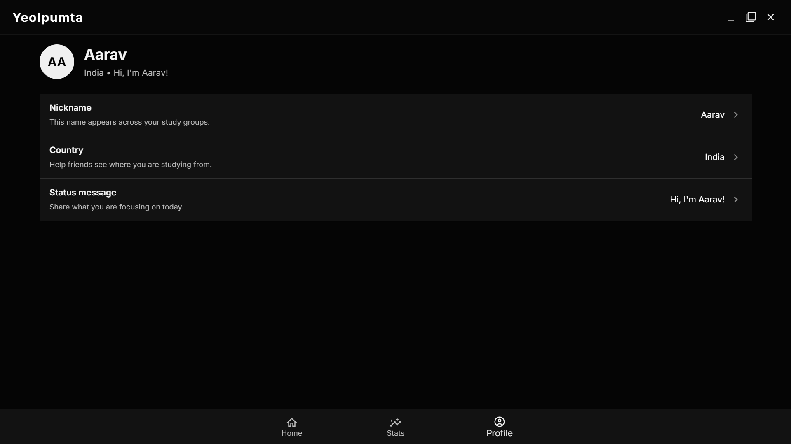

<h1 align="center">FocusFlow Desktop 💻</h1>

<p align="center">The FocusFlow study companion, reimagined for the desktop.</p>

<div align="center">
	
	
	
</div>

## ✨ Features

- ⏱️ **Pomodoro focus sessions** with automatic break suggestions, long-break scheduling, and streak tracking.
- 🧠 **Flashcards workspace** for creating decks, reviewing prompts, and logging mastery status.
- 🗒️ **Quick notes** editor to capture ideas, references, and study plans with instant search.
- ✅ **Task management** to organize your day with priorities, due dates, and completion tracking.
- 📊 **Progress analytics** featuring weekly summaries, activity trends, and productivity insights.
- ⚙️ **Personalized preferences** including themes, notification settings, and study goals stored locally via SQLite.
- 🖥️ **Offline-first desktop app** powered by Electron, React, and TypeScript for a smooth cross-platform experience.

## 🚀 Getting Started

FocusFlow is structured as a TypeScript project-reference monorepo with three packages:

- `shared` — shared types and IPC channel constants
- `main` — Electron main process
- `renderer` — Vite + React renderer

```pwsh
# install dependencies
npm install

# build TypeScript projects (shared -> main -> renderer)
npm run build:ts

# watch TypeScript in project-reference mode
npm run watch:ts

# launch the full dev experience (renderer + tsc watch + Electron)
npm run dev
```

### ℹ️ Development Notes

- The Electron main process uses `tsconfig-paths` at runtime so any `@shared/*` import resolves to `dist/shared`.
- If `better-sqlite3` native builds fail on Windows, install the Visual Studio Build Tools or use matching prebuilt binaries.

## 📦 Build & Package

```pwsh
# full production build
npm run build

# package the app with electron-builder (creates platform installers + ZIPs)
npm run package
```

Artifacts land in the `release/` directory and are automatically uploaded when you push a tag like `v3.0.0` thanks to the GitHub Actions workflow.
